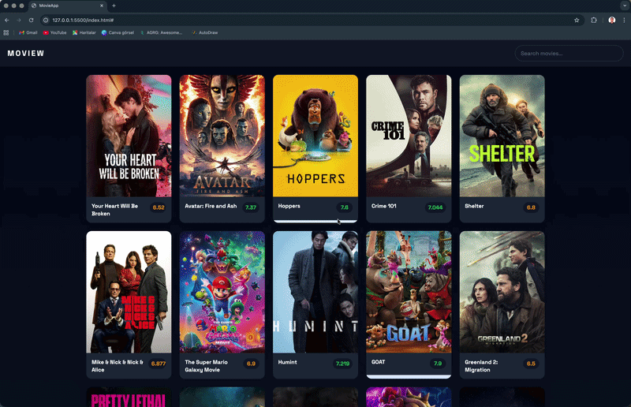

# 🎬 Movie App (TMDB API)

Demo

🚀 A modern movie discovery application built using HTML, CSS, and JavaScript.  
This project fetches real-time movie data from TMDB API and displays it in a clean, responsive UI.

---

## 🎯 Project Overview

This app allows users to:

✨ Browse popular movies  
🔍 Search movies by name  
⭐ See movie ratings with dynamic colors  
📱 Experience responsive and modern UI  

---

## 🖥️ Fullscreen Preview

A clean and modern movie layout inspired by real-world platforms like Netflix.

---

## 📸 Screenshots

📍 Movie cards with ratings and hover effects  

📍 Dynamic content loading from API  

---

## ⚙️ Technologies Used

- 🧱 HTML5  
- 🎨 CSS3 (Flexbox & modern UI)  
- ⚡ JavaScript (DOM & Fetch API)  
- 🎬 TMDB API  

---

## 🔥 Features

✔️ Real-time movie data  
✔️ Search functionality  
✔️ Dynamic rating color system (🟢 🟠 🔴)  
✔️ Responsive design  
✔️ Clean UI/UX  

---

## 🧠 What I Learned

This project helped me understand:

💡 API integration  
💡 Async JavaScript (fetch / async-await)  
💡 DOM manipulation  
💡 UI structuring and layout design  

---

## 🙏 Special Thanks

💙 Huge thanks to:https://github.com/isveckrali

👉 My instructor and mentors  
👉 The amazing learning platform https://github.com/Udemig 
👉 And everyone who supported my coding journey  

---

## 📬 Contact Me

👤 Numan Balık  
💼 LinkedIn: https://www.linkedin.com/in/numanbalik  
💻 GitHub: https://github.com/numanbalik-web  
📧 Email: numanbalik72@gmail.com  

---

## ⭐ Final Note

This project is part of my frontend development journey.  
More advanced and scalable projects are coming soon 🚀  

---

© 2026 Numan
